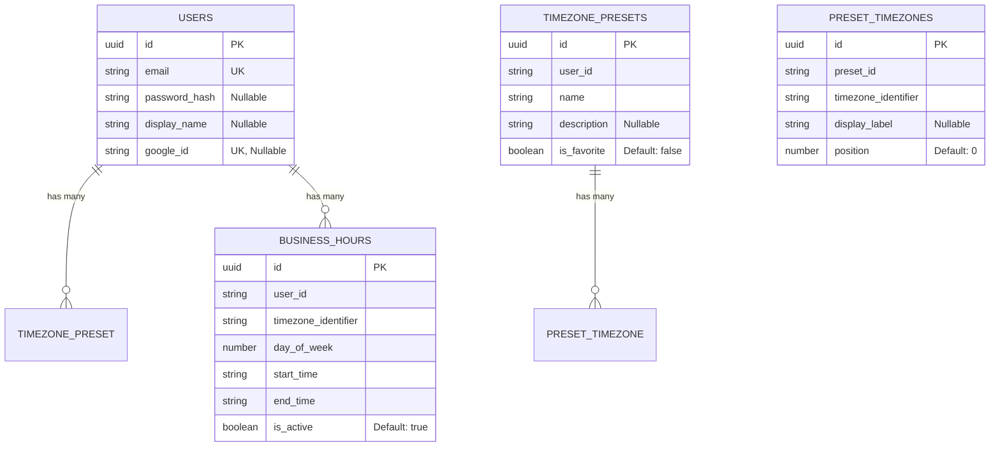

# Timezone Harmony - ER Diagram

## Auto-generated from TypeORM Entities

This diagram is automatically generated from TypeORM entity files.

**To update:** Run `npm run generate:erd`

## View Instructions

### In VS Code:
1. Install "Markdown Preview Mermaid Support" extension
2. Open this file
3. Press `Cmd+Shift+V` (Mac) or `Ctrl+Shift+V` (Windows)

### Online:
- Visit https://mermaid.live and paste the mermaid code above

Generated at: 2026-01-23T03:35:45.437Z
