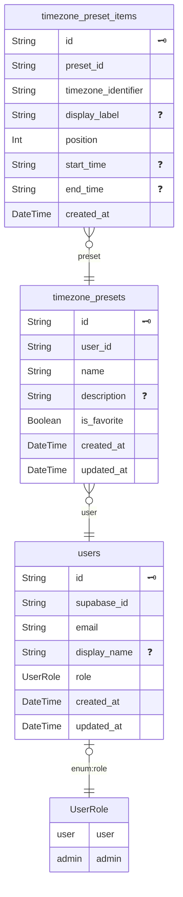

```mermaid
erDiagram

        UserRole {
            user user
admin admin
        }
    
  "users" {
    String id "🗝️"
    String supabase_id 
    String email 
    String display_name "❓"
    UserRole role 
    DateTime created_at 
    DateTime updated_at 
    }
  

  "timezone_presets" {
    String id "🗝️"
    String user_id 
    String name 
    String description "❓"
    Boolean is_favorite 
    DateTime created_at 
    DateTime updated_at 
    }
  

  "timezone_preset_items" {
    String id "🗝️"
    String preset_id 
    String timezone_identifier 
    String display_label "❓"
    Int position 
    String start_time "❓"
    String end_time "❓"
    DateTime created_at 
    }
  
    "users" |o--|| "UserRole" : "enum:role"
    "timezone_presets" }o--|| users : "user"
    "timezone_preset_items" }o--|| timezone_presets : "preset"
```
